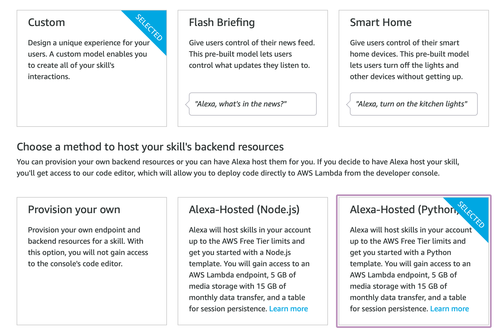
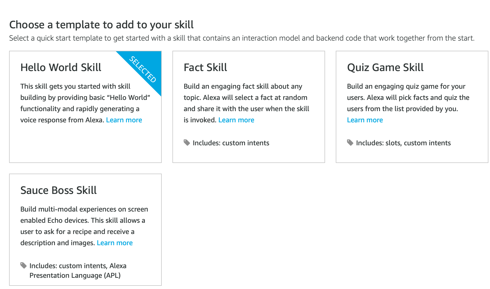
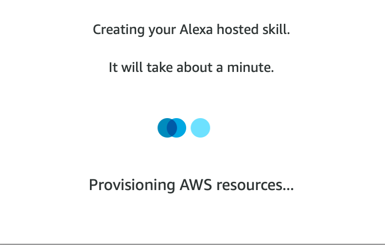
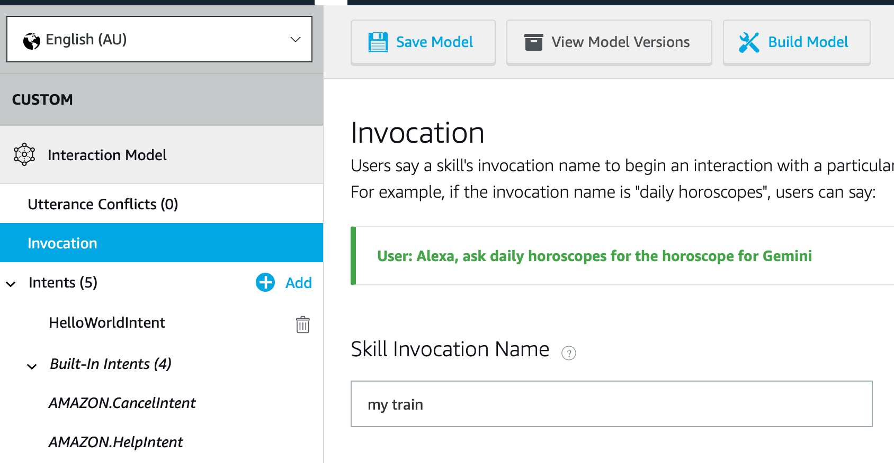
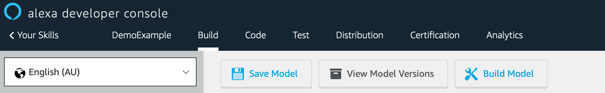
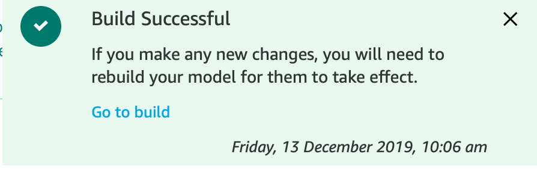
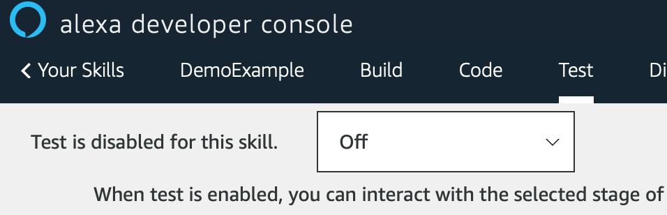
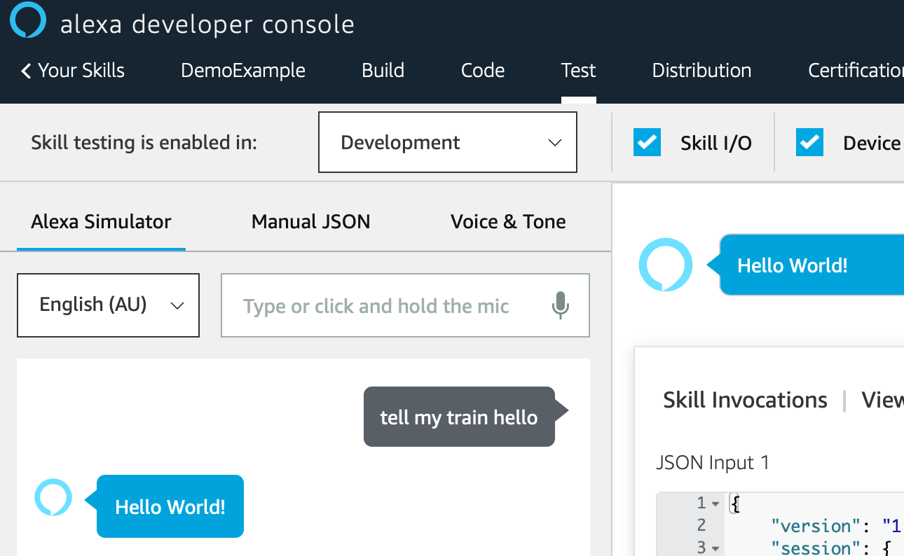

# Step 1: Create a skill

We'll start by creating a basic skill, so that we can change it to our liking later on.
Go to the Alexa Developer Console (https://developer.amazon.com/alexa/console/ask) and log in using your Amazon credentials. If this is your first time logging in, it will ask you a couple of questions and confirmations. If you don't have an Amazon account yet, you will need to create one.

Once logged in, you can create a new skill by clicking on the Create Skill button. Then fill in the name of your skill, which is just an internal name for your own use, pick the skills language (English (AU)) and make sure you have "Custom" and one of the "Alexa-Hosted" options selected.

Example code in this workshop uses the "Alexa-Hosted (Python)", but if you feel more comfortable using Node.js you're obviously welcome to use it.

On the next page, we'll choose the Hello World Skill to provide us with a standard setup. It's recommended you have a look at the other templates later, but we'll build some similar functionalities.

Now we wait for Alexa to create the skill.

The first thing we need to do now is go to the Invocation and change the name. As we'll build something to get information about our train, let's call it "my train".

Have a read through the Invocation name requirements underneath as well.

But we've now made our very first change, let's test that this actually works! First things first, we have to save our model and then build it. You will see two buttons for this in the top. Whenever these are highlighted, that means you've made unsaved or unbuilt changes. So, first click save and once that's completed Build.

Building takes about 10-20 seconds as it's all still pretty straightforward and you'll see a notification in the bottom right of your screen once it's successful.

Once that's succeeded, proceed to the Test tab in the interface. Depending on your browser and OS, this might ask you for permission to use your microphone.

The first thing you'll see here is that testing is disabled. That won't do for our purposes, so click on the dropdown you see and select Development. This will enable testing. We will only use the Alexa Simulator in the workshop, but again feel free to explore the other options.

At this stage you can either talk to the simulator or type your requests. In a group exercise, it is recommended to stick to typing and either muting your speakers or using headphones.

Congratulations! You've got your first working skill.
