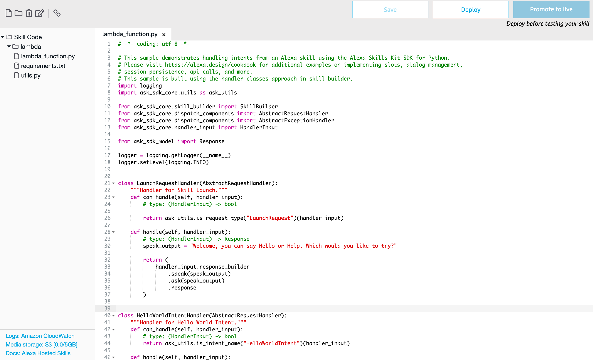

# Step 2: When is my train leaving?

Hello world is fun, but it's not super useful. So let's focus instead on building something useful. Let's build something that allows us to ask if we can make our train.

Start by going back to the Build section. We'll now start working with the Intents. We'll keep the HelloWorldIntent around for now, just so you can look at how it's configured, and will add a new Intent instead.


This will be a custom intent, and give it a suitable name. Something like "TrainScheduleIntent". Next you will need to add some ways people can ask whether they'll be able to make their train or not. Keep in mind that this should work as part of the complete sentence, including the invocation. So if you add an utterance "when it is coming" that would be the final part of the sentence:

"Alexa, ask my train when it is coming"


Alexa is smart enough to accept common alternatives to a sentence, so in this case it will also accept options like:

"Alexa, ask my train when it's coming"
"Alexa, ask my train when is it coming"
"Alexa, ask my train when it comes"

In fact, let's test that is indeed the case. After you add a couple more utterances, save and build your model and go to Test and try "ask my train when it comes".


This will show you that you just triggered the TrainScheduleIntent, but it doesn't actually do anything yet. Feel free to test your other utterances and some likely alternatives to it as well.

To actually make it do anything, we'll need to dive into the code. For that we'll go to the Code section. Here you will see the Lambda function that was created by Amazon for use with this skill. Let's have a quick look through the interface.



On the left is a file browser. We'll only concern ourselves with the `lambda_function.py` (or `.js`) today, but if you've built Lambda functions before this should look fairly straightforward.

On the right is the code editor, which does what it says. We'll spend most of our time in here when we make changes. At the bottom left, there are several important links that all open in new tabs. The top one takes you to the CloudWatch Logs, which shows you the logs for your Lambda function. Keep in mind that a new log stream is created every time you deploy your Lambda function, and you'll have to open that latest one to see the most recent logs.


Next is an S3 bucket, where you've got about 5GB of data that can be accessed by your Lambda function and therefore Alexa skill. As we're not playing with the interface today, we won't be using this.

The final link is to the documentation that tells you how to use all of this.

For now, we'll focus on the code and will make our TrainScheduleIntent work. We'll do this the professional way, so start by looking for the `HelloWorldIntentHandler` and then duplicate that using copy-paste. Then change the name to `TrainScheduleIntentHandler` and update the code to reflect what you need.

```python
class TrainScheduleIntentHandler(AbstractRequestHandler):
    """Handler for Train Schedule Intent."""
    def can_handle(self, handler_input):
        # type: (HandlerInput) -> bool
        return ask_utils.is_intent_name("TrainScheduleIntent")(handler_input)

    def handle(self, handler_input):
        # type: (HandlerInput) -> Response
        speak_output = "Yeah Nah, you're not going to make that one!"

        return (
            handler_input.response_builder
                .speak(speak_output)
                # .ask("add a reprompt if you want to keep the session open for the user to respond")
                .response
        )

```

You now need one more thing here, which is at the bottom of the handler where you need to register this new request handler. Add a line there to do so underneath the existing one for the `HelloWorldIntentHandler`.

```python
sb = SkillBuilder()

sb.add_request_handler(LaunchRequestHandler())
sb.add_request_handler(HelloWorldIntentHandler())
sb.add_request_handler(TrainScheduleIntentHandler())
```

Now Save and Deploy the function using the buttons at the top. We can now test again that it works correctly.


Great! We are now getting the answers we actually want! But let's now hook this up to collecting some actual data. In lieu of connecting to a real train API there is a fake one that I set up for this workshop. When calling this endpoint you get a JSON result with randomly generated results of the form:

```json
{
  "platform": 14,
  "leaves_in": 19,
  "size": "medium",
  "max_passengers": 819,
  "passengers": 232
}
```

The temporary URL for this API is `https://sf0lpvreqc.execute-api.ap-southeast-2.amazonaws.com/Prod/schedule/`.

Update your code to call this API and parse the response from the API and base your response off that.

An example of that is to update it like the below:

```python
class TrainScheduleIntentHandler(AbstractRequestHandler):
    """Handler for Train Schedule Intent."""
    def can_handle(self, handler_input):
        # type: (HandlerInput) -> bool
        return ask_utils.is_intent_name("TrainScheduleIntent")(handler_input)

    def handle(self, handler_input):
        response = requests.get("https://sf0lpvreqc.execute-api.ap-southeast-2.amazonaws.com/Prod/schedule/")
        result = response.json()
        # type: (HandlerInput) -> Response
        if result['leaves_in'] < 3:
            speak_output = "Yeah, nah. Your train is leaving very soon. You're not gonna make that."
        elif result['leaves_in'] < 10:
            speak_output = "Your train leaves in " + str(result['leaves_in']) + " minutes! Better start running to platform " + str(result['platform']) + "!"
        else:
            speak_output = "Your train leaves in " + str(result['leaves_in']) + " minutes from platform " + str(result['platform']) + ". Plenty of time"


        return (
            handler_input.response_builder
                .speak(speak_output)
                # .ask("add a reprompt if you want to keep the session open for the user to respond")
                .response
        )
```

And don't forget to import the requests library at the top of the page.

```python
import logging
import ask_sdk_core.utils as ask_utils
import requests
```

And of course, after saving and deploying your changes, make sure to test that everything is correct. If you're getting errors, remember to look at the CloudWatch Logs linked from the bottom left in the Code section.


And now we know whether we can make it in time for our train! Better start running though...

[Next Step](step3.md)
