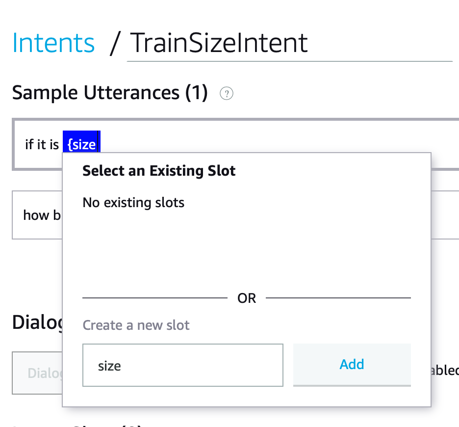
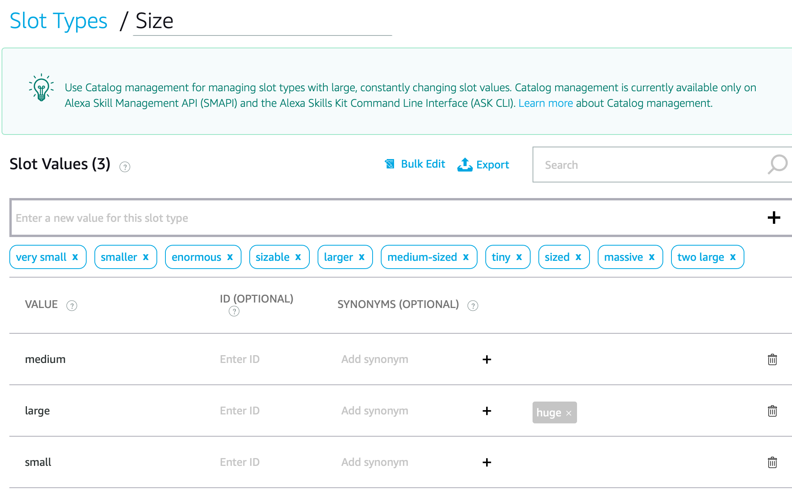
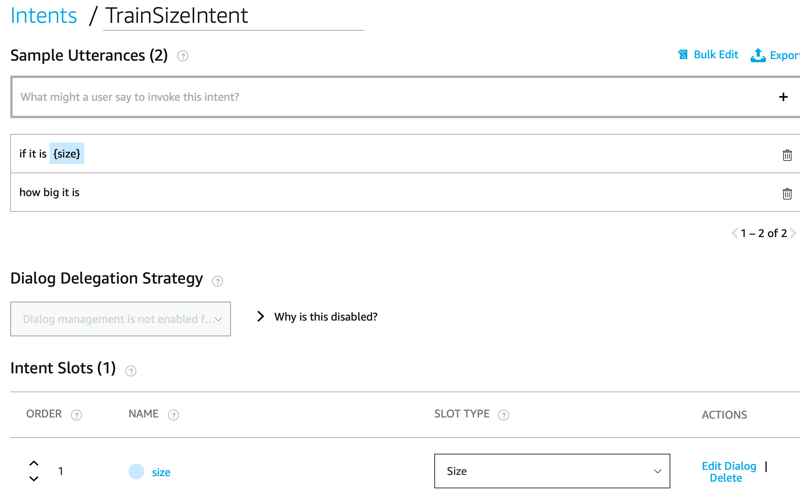
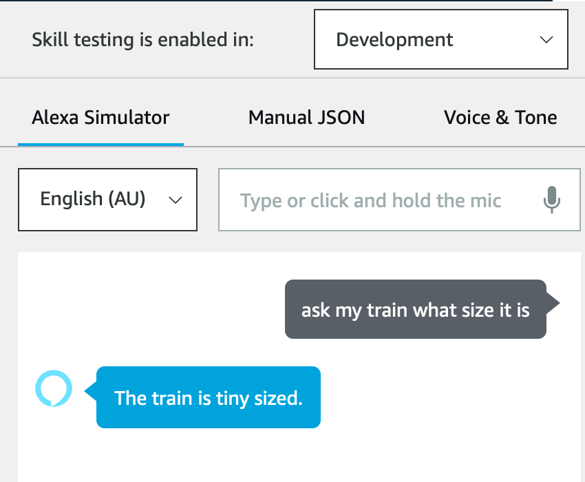
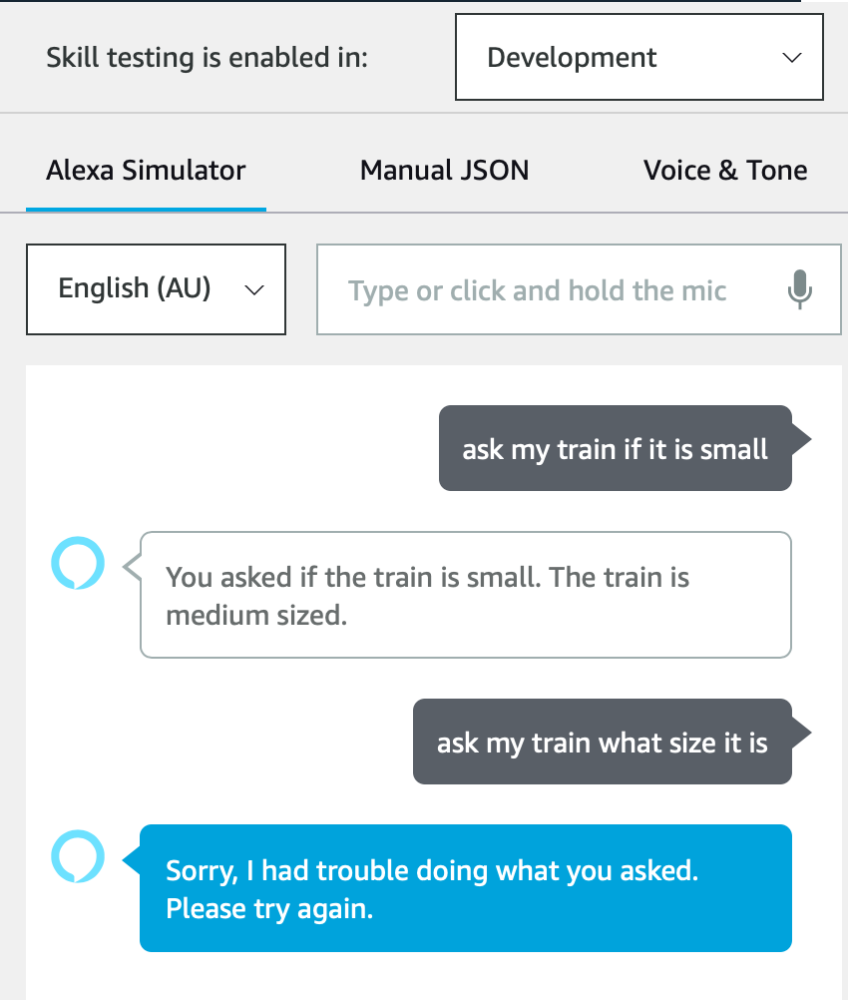

# Step 3: How big is my train?

Let's add another Intent, this time we want to check the size of our train. For that we'll use Slots.

First, let's create a new Intent named `TrainSizeIntent`. And then in the utterances we add a slot. You can do so by typing a `{` and filling in the small form that pops up.



As this is a new slot, we name it `size` and add it. At this stage you might want to try building the model and you will see that it fails as we haven't added a slot type for size yet.

You can add a slot type from the dropdown in the Intent Slots part of the Intent configuration, but you will see that while that contains many Amazon provided slots, it doesn't actually have anything for sizes. So instead we'll create one.

We'll create one called `Size` and fill in some basic values. Once you start adding these, Alexa will suggest additional options that you can add as values or as synonyms. Synonyms mean that Alexa will accept the term, but will pass through the original value to your code. This makes it a lot easier to handle similar options in your code.



Now that we've got our Slot, we need to add it to the Intent Slot.



And now building our model works again! So it's time to add the code. So we'll start by quickly creating a `TrainSizeIntentHandler` function and add it to the list.

```python
class TrainSizeIntentHandler(AbstractRequestHandler):
    """Handler for Train Size Intent."""
    def can_handle(self, handler_input):
        # type: (HandlerInput) -> bool
        return ask_utils.is_intent_name("TrainSizeIntent")(handler_input)

    def handle(self, handler_input):
        response = requests.get("https://sf0lpvreqc.execute-api.ap-southeast-2.amazonaws.com/Prod/schedule/")
        result = response.json()
        # type: (HandlerInput) -> Response
        speak_output = "The train is " + result['size'] + " sized."

        return (
            handler_input.response_builder
                .speak(speak_output)
                # .ask("add a reprompt if you want to keep the session open for the user to respond")
                .response
        )
```

```python
sb.add_request_handler(HelloWorldIntentHandler())
sb.add_request_handler(TrainScheduleIntentHandler())
sb.add_request_handler(TrainSizeIntentHandler())
```

Keep in mind that the order in which you load the handlers matters. The handler with the first match will be triggered. After this, let's quickly deploy the updated code (and build the model if you didn't do so before) and test it.



Excellent! We now know what size it is, but we're not dealing yet with the slots. So, let's include the requested size in the answer. You can do this by getting the value of the slot in your code:

```python
        requested_size = handler_input.request_envelope.request.intent.slots["size"].value
        speak_output = "You asked if the train is " + requested_size + ". The train is " + result['size'] + " sized."
```



And it works! Sort of... As you can see, this now breaks the functionality for the question where we didn't include the slot. You can solve this in different ways, either through your code or your model. The last part of this step is to actually fix it.

[Next Step](step3.md)
